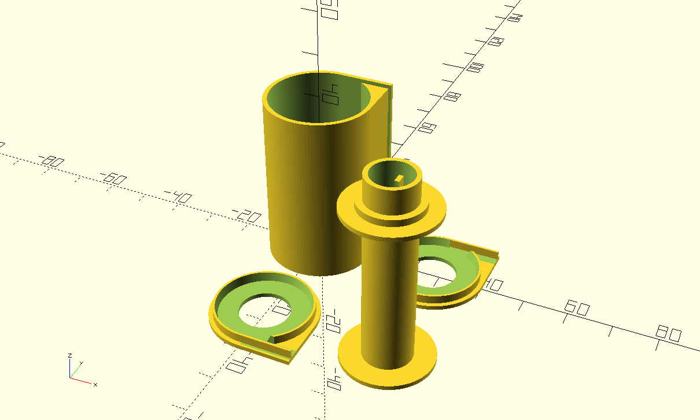

# A Re-usable 35mm Film Cartridge
A 3D-printable re-usable film cartridge for 135 cameras.

The cartridge, spool, and lids should be printed, then a set of two felt light seals should be glued along the opposite sides of the cartridge film opening. I used the soft side of a piece of black velcro, but a strip of black felt can also be used. Use a knife blade to keep the two felt pieces from sticking to each other. Once the glue has set, the felt can be trimmed at each end.

Once you've attached the felt, glue one end piece in place. Attach the film strip to the reel with a piece of tape, slide it into the cartridge with the film between the pieces of felt. Then place the other end piece on the cartridge and secure it with a piece of masking tape. You can then wind the film into the cartridge.

Take care for light leaks, suggest loading in a darkroom and avoiding strong light when loading your camera.

## Licence

This model is licensed under the [Creative Commons Attribution Share Alike 4.0 International licence](license.md).

